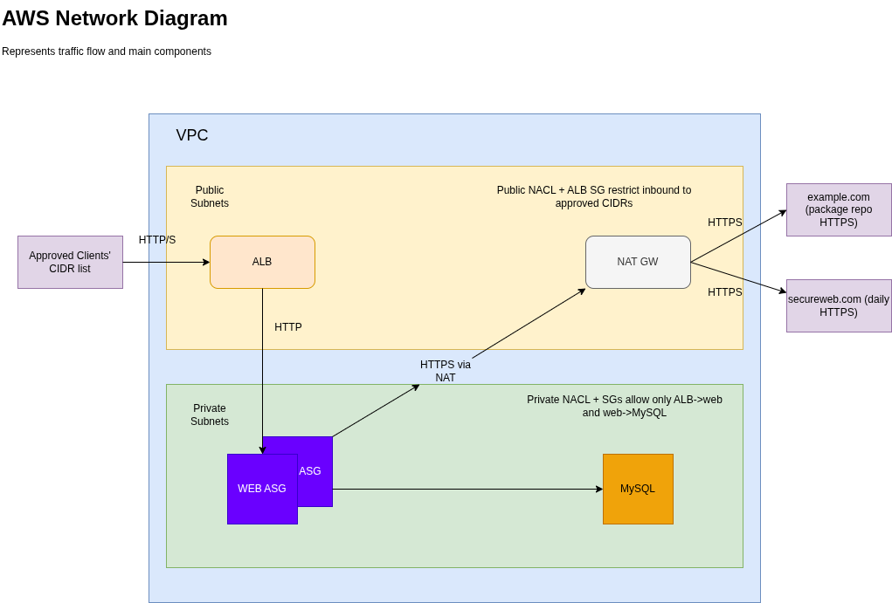

# altium-demo

Terraform POC for an AWS application environment with restricted network access.

## Requirements

- PCI-DSS 1.3.1: inbound traffic to the CDE is restricted to necessary traffic and all other inbound traffic is denied.
- PCI-DSS 1.3.2: outbound traffic from the CDE is restricted to necessary traffic and all other outbound traffic is denied.
- EC2 Linux app instance, implemented as a single instance inside an Auto Scaling Group.
- EC2 Linux MySQL instance.
- VPC, subnets, ALB, security groups, and supporting network controls managed by Terraform.
- Internet-facing ALB with an SSL certificate attached.
- Inbound traffic limited to a finite list of approved IP addresses.
- App instance bootstrap installs the required application package from `example.com`.
- Daily app operation allows HTTPS communication to `secureweb.com`.
- All other traffic should be denied by default or explicitly denied.
- Prepare a 5-day audit fallback if the final rollout takes longer.

## Requirement Coverage

| Requirement | Coverage |
| --- | --- |
| Terraform-managed POC for AWS infrastructure | Covered by VPC, ALB, ACM, Route53, EC2, ASG, SG, and NACL resources. |
| EC2 Linux app instance | Covered by `aws_launch_template.web` and `aws_autoscaling_group.web` with desired capacity 1. |
| EC2 Linux MySQL instance | Covered by `aws_instance.mysql` in a private subnet. |
| VPC and subnets | Covered by the VPC module with three public subnets for ALB/NAT and three private subnets for EC2. |
| Internet-facing ALB with SSL certificate | Covered by public ALB, HTTP redirect listener, HTTPS listener, ACM certificate, and Route53 alias. |
| Inbound traffic limited to finite IP list | Covered by `allowed_inbound_cidr_blocks`, ALB SG ingress, public NACL ingress, and validation rejecting `0.0.0.0/0`. |
| PCI-DSS 1.3.1 inbound restriction | Covered by ALB SG, web SG, MySQL SG, and explicit NACL deny-all rules after required inbound allows. |
| Startup package from `example.com` gates application start | Covered by web user-data. The app service starts only after the required repo install succeeds, unless the debug bypass is explicitly enabled. |
| Daily HTTPS communication to `secureweb.com` | Covered by `secureweb_https_cidrs`, web SG egress, and NACL outbound/return rules. |
| PCI-DSS 1.3.2 outbound restriction | Covered by SG/NACL egress rules for ALB-to-web HTTP, web-to-MySQL, package repository HTTPS, and `secureweb.com` HTTPS. |
| Simple POC diagram | Covered by `altium.drawio.png`. |
| Alternative for audit in 5 days | Covered by the 5-day audit fallback section. |

## POC Diagram



## Security Model

- `allowed_inbound_cidr_blocks` is required and rejects `0.0.0.0/0` and `::/0`.
- ALB security group allows inbound TCP 80 and 443 only from `allowed_inbound_cidr_blocks`.
- ALB egress is limited to TCP 80 toward the private web subnets.
- Web EC2 ingress allows TCP 80 only from the ALB security group.
- Web EC2 egress allows TCP 3306 to private database subnets and TCP 443 only to package repository and `secureweb.com` CIDRs.
- MySQL ingress allows TCP 3306 only from the web EC2 security group.
- MySQL egress is limited to HTTPS package repository access for bootstrap.
- Public and private NACLs include explicit allow rules for required flows and explicit deny-all rules afterward.
- `allow_web_package_install_debug_bypass` keeps the lab usable when `example.com` does not host the package. When enabled, extra SG/NACL egress rules are created from `debug_package_install_bypass_cidrs`; this should remain disabled for audit evidence.

## Required Inputs

Set the approved inbound CIDRs before planning or applying:

```hcl
allowed_inbound_cidr_blocks = [
  "203.0.113.10/32"
]
```

The default `secureweb.com` and `example.com` CIDRs are POC values and should be verified before rollout because DNS-backed services can change IP addresses.

For local debugging only:

```hcl
allow_web_package_install_debug_bypass = true
```

This bypass lets the web service start even when the required package cannot be installed from `example.com`. It is intentionally visible through Terraform output.

## 5-Day Audit Fallback

If the full Terraform rollout or resource import cannot be completed before the audit window:

- Document the current AWS setup before making changes: save AWS CLI JSON or screenshots of the VPC, subnets, route tables, ALB listeners, target groups, security groups, NACLs, EC2 instances, and ASG.
- Replace broad inbound rules manually: ALB security group allows TCP 80/443 only from the approved finite CIDR list, web instances allow TCP 80 only from the ALB security group, and MySQL allows TCP 3306 only from the web security group.
- Replace default outbound rules manually: web instances allow only HTTPS to verified `example.com` package repository CIDRs, HTTPS to verified `secureweb.com` CIDRs, and MySQL TCP 3306 to the private database subnets; MySQL allows only required package repository HTTPS.
- Apply a temporary NACL decision and document it: either mirror the allow/deny model from `nacl.tf`, including explicit deny-all rules, or record security groups as the compensating control with a dated post-audit NACL rollout ticket.
- Freeze non-emergency network changes during the audit, keep `allow_web_package_install_debug_bypass = false`, validate application startup and `secureweb.com` HTTPS access, then import or reconcile every manual change back into Terraform after the audit.
